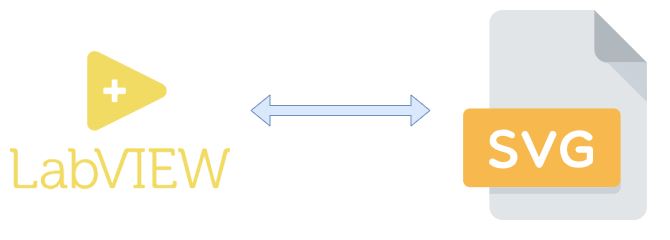
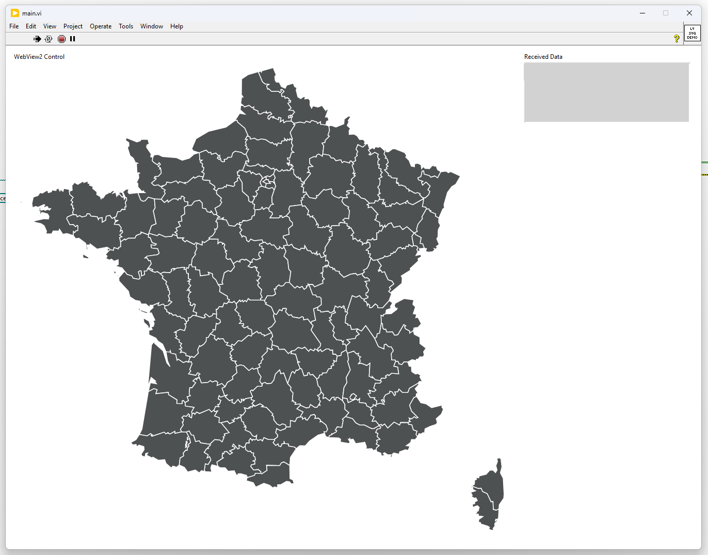
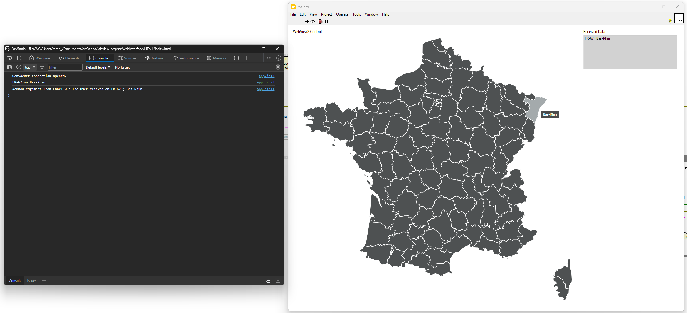

    

# LabVIEW and SVG integration
The idea behind this project is to demonstrate how to improve User Interface by using SVG and Javascript thanks to the WebView2 control and the websocket API.

This project will display the map of France where the User can click on any region to get the name of it. The click of User will be sent back to the server and log in the console.

## Table of content
- [LabVIEW and SVG integration](#labview-and-svg-integration)
  - [Table of content](#table-of-content)
- [Acknowledgements](#acknowledgements)
- [Built with](#built-with)
- [How to use it](#how-to-use-it)
  - [Prerequisite](#prerequisite)
  - [Run the application](#run-the-application)
- [Reflections on Preferences: Exploring Likes and Dislikes.](#reflections-on-preferences-exploring-likes-and-dislikes)
  - [Pros](#pros)
  - [Cons](#cons)
  - [When should you use it ?](#when-should-you-use-it-)
- [License](#license)

# Acknowledgements

This project would not have been possible without the following tools, libraries and tutorials:
* The project was inspired by the tutorial from "[Grafikart.fr](https://grafikart.fr/tutoriels/carte-interactive-791)"
* The SVGs were downloaded from [amcharts.com](https://www.amcharts.com/svg-maps/)
* The LabVIEW [WebView2 package](https://github.com/kleinsimon/LV-WebView2) / [VIPM](https://www.vipm.io/package/sklein_lib_webview2/)
* The LabVIEW [Websockets API](https://github.com/MediaMongrels-Ltd/LabVIEW-WebSockets-API) / [VPIM](https://www.vipm.io/package/mediamongrels_ltd_lib_websockets_api/)
* [Inkscape](https://inkscape.org/) : The best tool to edit .svg
* [SVG Repo](https://www.svgrepo.com/) : For providing open-licensed SVG.

# Built with

[![LabVIEW][LabVIEW]][LabVIEW-url]
[![JS][js]][js-url]

# How to use it

## Prerequisite
 * LabVIEW 2020 or greater
 * The package [WebView2](https://www.vipm.io/package/sklein_lib_webview2/) installed from the VIPM
 * The package [Websockets API](https://www.vipm.io/package/mediamongrels_ltd_lib_websockets_api/) installed from the VIPM

## Run the application

Open the labview project [labview-svg.lvproj](./src/labview/labview-svg.lvproj) then open the main.vi and run it. You should have the following window:

By clicking on any region you should see the name of the region in the "received data" output and a message in the console log of the web browser. To diplay it, click on it and the press <b> ctrl+shift+i </b>. The following image is an example:

To stop the program click om the red cross or press <b> ctrl+w </b>.

# Reflections on Preferences: Exploring Likes and Dislikes.

## Pros

* The debug from the web browser is great and always available (even with a build)
* Shallow learning curve for basic HTML, CSS and JS with the Websocket API
* The amount of resources for web related script and all of the free AI tool available
* The easiness to have clean interface and to not need "to reinvent the wheel"

## Cons

* The first time you set a build can be tricky (unfortunately I don't have the required license to give an example)
* The HTML, CSS and JS script are not compiled, there for not hidden

## When should you use it ?

# License
Distributed under the MIT License. See [LICENSE.txt](./LICENSE.txt) for more information.

[LabVIEW]: https://img.shields.io/badge/labview-000000?style=for-the-badge&logo=labview&logoColor=white
[LabVIEW-url]: https://www.ni.com/fr/support/downloads/software-products/download.labview.html
[js]:https://img.shields.io/badge/javascript-000000?style=for-the-badge&logo=javascript&logoColor=white
[js-url]:https://developer.mozilla.org/fr/docs/Web/JavaScript
